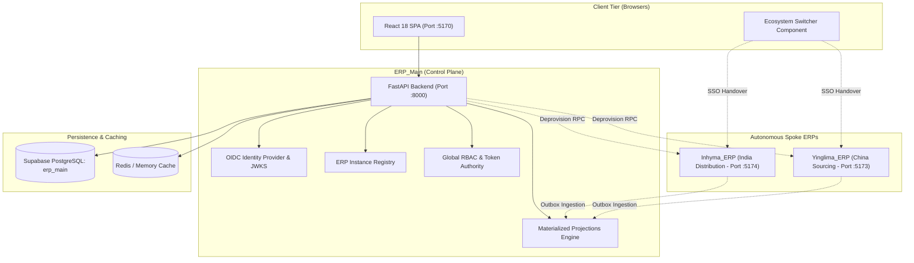

# ERP_Main — System Architecture & Design Specification

**System Role:** Central Control Plane, Identity Provider & Global Projection Hub  
**Architecture Type:** FastAPI Async Microservice + React 18 SPA (Vite)  
**Database:** PostgreSQL (Supabase Cloud Pooler / Dedicated Database Schema)  
**Location:** `ERP_Main/`

---

## 1. Architectural Topology & System Role

`ERP_Main` serves as the authoritative control plane, single sign-on (SSO) identity provider, and global reporting aggregation hub for the entire multi-ERP ecosystem.



---

## 2. Core Architectural Pillars

### 2.1 Central Identity & Single Sign-On (OIDC Authority)
- **Token Issuer:** Issues cryptographically signed RS256 JWT tokens with asymmetric JSON Web Key Sets (JWKS) exposed at `/.well-known/jwks.json`.
- **Ecosystem Session Engine:** Maintains `ihm_ecosystem_session` HTTP-only cross-subdomain cookies tracking authorized spoke ERPs (`allowed_erps: ["inhyma", "yinglima", "control-plane"]`).
- **SSO Handover:** Generates high-entropy, short-lived (60s) single-use authorization tokens allowing seamless user transition between ERP applications without credential re-entry.
- **Identity Preservation:** SSO handover preserves the authenticated user's local name and email (`first_name`, `email`), permanently preventing unauthorized fallback to administrative accounts.

### 2.2 Global ERP Access Governance & Single-Point Grants
- **Consolidated User Directory:** Global users are centrally managed at `/access/users`.
- **Direct Access Grants:** Replaced decoupled membership assignment with inline checkboxes (`ERP Access Grants`) in the User Create and Edit modals.
- **Dynamic Deprovisioning:** Unchecking an ERP access grant invokes the spoke's internal API (`POST /api/v1/internal/users/{id}/deprovision`), soft-deleting the user record on the spoke and invalidating all active sessions.
- **Status Normalization:** Revoked or unassigned spoke access renders cleanly as `None` badges (`Inhyma: • None`).

### 2.3 Conditional Routing Engine (Single-ERP vs Multi-ERP)
- **Single-ERP Authorized Users:** If an account only has permission for one spoke (e.g. Yinglima only), logging into `ERP_Main` (`:5170`) immediately redirects them to their designated spoke ERP with an SSO handover token. The central control plane dashboard and ecosystem switcher are hidden.
- **Multi-ERP Authorized Users:** Users with access to multiple ERPs land on the ERP Dashboard and are provided with the topbar Ecosystem Switcher dropdown across all applications.
- **Platform Super Admins:** Unrestricted access across all registered ERP instances.

### 2.4 Materialized Analytical Projections
- Asynchronously consumes transactional outbox events from spoke ERPs.
- Builds high-performance read-only projections for cross-system executive search, financial metrics, and operational dashboards.
- Features idempotency deduplication (`event_id` tracking) and Dead Letter Queue (DLQ) retry mechanisms.

---

## 3. Directory Layout & Module Decomposition

```
ERP_Main/
├── backend/
│   ├── app/
│   │   ├── api/v1/               # Router aggregation & versioning
│   │   ├── core/                 # App configuration, security, JWT settings
│   │   ├── database/             # SQLAlchemy async engine & session factories
│   │   ├── global_auth/          # Login, refresh, ecosystem session cookies
│   │   ├── global_users/         # Global user entity, CRUD, and password hashing
│   │   ├── platform_roles/       # System-wide RBAC roles and permissions
│   │   ├── erp_registry/         # Registered spoke ERP nodes, URLs, and keys
│   │   ├── erp_memberships/      # Identity linking between global and spoke IDs
│   │   ├── identity_linking/     # Outbound adapters (HTTP, internal RPC)
│   │   ├── oidc/                 # OpenID Connect server & JWKS keys
│   │   ├── projections/          # Cross-ERP event projection consumers
│   │   └── export_engine/        # Secure async CSV/XLSX export service
│   ├── alembic/                  # Version-controlled database migrations
│   └── tests/                    # Backend test suites (85+ automated tests)
└── frontend/
    ├── src/
    │   ├── components/           # AppShell, EcosystemSwitcher, UI tokens
    │   ├── lib/                  # API client, auth context, autocomplete blocker
    │   ├── pages/                # Dashboard, GlobalUsers, PlatformAuthz, ErpRegistry
    │   ├── styles/               # style.css (spin button removal, responsive layout)
    │   ├── App.tsx               # Route definitions & global blocker initialization
    │   └── main.tsx              # React DOM entrypoint & mouse wheel blur lockout
    └── package.json
```

---

## 4. Key Architectural Invariants & Guarantees

1. **Decoupled Database Autonomy:** `ERP_Main` connects to its own database schema (`erp_main`). It never directly queries or modifies spoke ERP tables, enforcing loose coupling via authenticated REST APIs.
2. **Bootstrap Root Protection:** Platform root admin (`admin@example.com` / `admin`) is permanently protected from deprovisioning, deletion, or permission revocation.
3. **Idempotent Deprovisioning:** Multiple consecutive deprovisioning requests safely return HTTP 200 without database corruption.
4. **Zero Push Guarantee:** All development, testing, and modifications remain 100% local without invoking remote git pushes or pulls.
