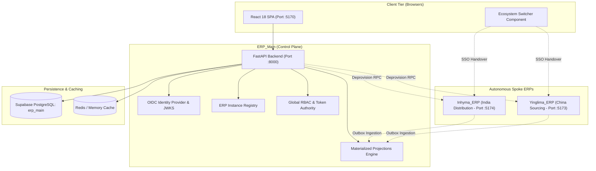

# ERP_Main — System Architecture & Design Specification

**System Role:** Central Control Plane, Identity Provider & Global Projection Hub  
**Architecture Type:** FastAPI Async Microservice + React 18 SPA (Vite)  
**Database:** PostgreSQL (Supabase Cloud Pooler / Dedicated Database Schema)  
**Location:** `ERP_Main/`

---

## 1. Architectural Topology & System Role

`ERP_Main` serves as the authoritative control plane, single sign-on (SSO) identity provider, and global reporting aggregation hub for the entire multi-ERP ecosystem.



---

## 2. Core Architectural Pillars

### 2.1 Central Identity & Single Sign-On (OIDC Authority)
- **Token Issuer:** Issues cryptographically signed RS256 JWT tokens with asymmetric JSON Web Key Sets (JWKS) exposed at `/.well-known/jwks.json`.
- **Ecosystem Session Engine:** Maintains `ihm_ecosystem_session` HTTP-only cross-subdomain cookies tracking authorized spoke ERPs (`allowed_erps: ["inhyma", "yinglima", "control-plane"]`).
- **SSO Handover:** Generates high-entropy, short-lived (60s) single-use authorization tokens allowing seamless user transition between ERP applications without credential re-entry.
- **Identity Preservation:** SSO handover preserves the authenticated user's local name and email (`first_name`, `email`), permanently preventing unauthorized fallback to administrative accounts.

### 2.2 Global ERP Access Governance & Single-Point Grants
- **Consolidated User Directory:** Global users are centrally managed at `/access/users`.
- **Direct Access Grants:** Replaced decoupled membership assignment with inline checkboxes (`ERP Access Grants`) in the User Create and Edit modals.
- **Dynamic Deprovisioning:** Unchecking an ERP access grant invokes the spoke's internal API (`POST /api/v1/internal/users/{id}/deprovision`), soft-deleting the user record on the spoke and invalidating all active sessions.
- **Status Normalization:** Revoked or unassigned spoke access renders cleanly as `None` badges (`Inhyma: • None`).

### 2.3 Conditional Routing Engine (Single-ERP vs Multi-ERP)
- **Single-ERP Authorized Users:** If an account only has permission for one spoke (e.g. Yinglima only), logging into `ERP_Main` (`:5170`) immediately redirects them to their designated spoke ERP with an SSO handover token. The central control plane dashboard and ecosystem switcher are hidden.
- **Multi-ERP Authorized Users:** Users with access to multiple ERPs land on the ERP Dashboard and are provided with the topbar Ecosystem Switcher dropdown across all applications.
- **Platform Super Admins:** Unrestricted access across all registered ERP instances.

### 2.4 Materialized Analytical Projections
- Asynchronously consumes transactional outbox events from spoke ERPs.
- Builds high-performance read-only projections for cross-system executive search, financial metrics, and operational dashboards.
- Features idempotency deduplication (`event_id` tracking) and Dead Letter Queue (DLQ) retry mechanisms.

### 2.5 Bi-Directional Password Synchronization & Unified Identity
- **Single Password Per Identity:** Password updates originating from either ERP_Main or any connected spoke ERP (e.g., Inhyma or Yinglima) are automatically propagated throughout the entire ecosystem.
- **Inbound Spoke Sync (`POST /api/v1/internal/users/password`):** Spoke backends securely submit changed passwords with internal service credentials; ERP_Main persists them centrally and immediately fans out re-provisioning calls across all other active ERP memberships (`push_password_to_memberships`).
- **Graceful Fallback:** Operations never fail if a peer spoke is temporarily unreachable; spoken logins automatically verify credentials against the live central ecosystem session.

### 2.6 Durable Access Sync Recovery Engine (`access_sync_tasks`)
- **Fault-Tolerant Deprovisioning:** When an administrator revokes, suspends, or restores user access in ERP_Main, any network error reaching a spoke triggers a durable database record in `access_sync_tasks`.
- **Bounded Exponential Backoff & Leases:** Tasks are reclaimed and retried with distributed worker leases (`claimed_by`, `lease_expires_at`) preventing duplicate execution.
- **Fail-Closed Verification:** Spoke login verification calls ERP_Main's live database state, ensuring that even during synchronization delays, revoked users cannot access spoke ERPs.

### 2.7 High-Scale Performance Architecture & Driver Hardening
- **Functional & Composite Indexes:** Case-insensitive email indexing (`lower(primary_email)`) and composite status indexes on `erp_memberships` guarantee zero-latency lookups across tens of thousands of global users.
- **PgBouncer Statement Cache Auto-Disable:** Connection engine auto-detects port 6543 / PgBouncer and sets `statement_cache_size=0`, preventing `DuplicatePreparedStatementError`.
- **Permanent Role Deletion:** Separates mandatory system roles from starter demo roles, skipping demo re-seeding on existing databases to permanently respect administrative role deletions.

---

## 3. Directory Layout & Module Decomposition

```
ERP_Main/
├── backend/
│   ├── app/
│   │   ├── api/v1/               # Router aggregation & versioning
│   │   ├── core/                 # App configuration, security, JWT settings
│   │   ├── database/             # SQLAlchemy async engine & session factories
│   │   ├── global_auth/          # Login, refresh, ecosystem session cookies
│   │   ├── global_users/         # Global user entity, CRUD, and password hashing
│   │   ├── platform_roles/       # System-wide RBAC roles and permissions
│   │   ├── erp_registry/         # Registered spoke ERP nodes, URLs, and keys
│   │   ├── erp_memberships/      # Identity linking between global and spoke IDs
│   │   ├── identity_linking/     # Outbound adapters (HTTP, internal RPC)
│   │   ├── oidc/                 # OpenID Connect server & JWKS keys
│   │   ├── projections/          # Cross-ERP event projection consumers
│   │   └── export_engine/        # Secure async CSV/XLSX export service
│   ├── alembic/                  # Version-controlled database migrations
│   └── tests/                    # Backend test suites (85+ automated tests)
└── frontend/
    ├── src/
    │   ├── components/           # AppShell, EcosystemSwitcher, UI tokens
    │   ├── lib/                  # API client, auth context, autocomplete blocker
    │   ├── pages/                # Dashboard, GlobalUsers, PlatformAuthz, ErpRegistry
    │   ├── styles/               # style.css (spin button removal, responsive layout)
    │   ├── App.tsx               # Route definitions & global blocker initialization
    │   └── main.tsx              # React DOM entrypoint & mouse wheel blur lockout
    └── package.json
```

---

## 5. Spoke Machine Identifiers vs. Dynamic Human Branding

1. **Unique Machine Identifier Protocol (`erp-01` and `erp-02`):**
   - The central control plane addresses and syncs spoke instances using unique, stable machine IDs (`erp-01` for port 8002 and `erp-02` for port 8001).
   - Configured in [`config.py`](file:///c:/Users/Inhyma%20Solutions/OneDrive/Desktop/ERP/ERP_Main/backend/app/core/config.py) and mapped in [`http_adapter.py`](file:///c:/Users/Inhyma%20Solutions/OneDrive/Desktop/ERP/ERP_Main/backend/app/identity_linking/adapters/http_adapter.py).

2. **Decoupled Human-Facing Spoke Names:**
   - Display labels and company titles are never hardcoded.
   - The topbar [`EcosystemSwitcher.tsx`](file:///c:/Users/Inhyma%20Solutions/OneDrive/Desktop/ERP/ERP_Main/frontend/src/components/EcosystemSwitcher.tsx) dynamically queries spoke `/organizations/public` endpoints to render the real company name as configured in that spoke's **ERP Settings -> Company Name**.
   - User provisioning grant checkboxes in [`GlobalUsers.tsx`](file:///c:/Users/Inhyma%20Solutions/OneDrive/Desktop/ERP/ERP_Main/frontend/src/pages/GlobalUsers.tsx) dynamically display `{erp.name || erp.display_name}`.
