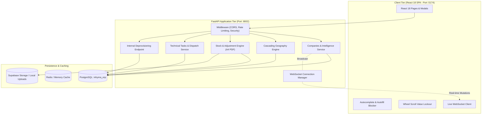

# Inhyma_ERP — System Architecture & Design Specification

**System Role:** India Distribution, Production Planning, B2B Accounts & Field Service Engineering  
**Architecture Type:** Modular Async Monolith (FastAPI) + React 18 SPA (Vite) + WebSocket Real-Time Event Bus  
**Database:** PostgreSQL (Supabase Cloud Pooler / Dedicated Database Schema)  
**Location:** `Inhyma_ERP/`

---

## 1. System Topology & Architectural Pattern

`Inhyma_ERP` manages domestic India distribution, B2B corporate customer directories, stock reconciliation, and field service dispatching.



---

## 2. Core Domain Architectures

### 2.1 B2B Company Domain & Extended Corporate Intelligence
- **Entity Overview:** Complete legal, commercial, and operational profile for domestic clients and suppliers.
- **Extended Intelligence Matrix:**
  - `pincode`: 6-digit postal code.
  - `district_id`: Relational foreign key referencing `districts.id`.
  - `company_category`: Corporate categorization (`Manufacturer`, `Trader`, `OEM`, `Service`).
  - `product_manufacture_or_supply`: In-depth goods manufactured or supplied.
  - `machines_buying_from`: Competitor and vendor intelligence tracking for machinery.
  - `spares_buying_from`: Intelligence tracking for spare parts and tooling.
  - `products_interested`: Target demand and product interest areas.
  - `gst_registration_date`: Tax authority registration timestamp.
  - `age_of_company`: Operational tenure in years.
  - `social_media`: Dynamic JSON matrix `[{"platform": "LinkedIn", "url": "https://..."}, ...]` with an interactive repeater in the UI.

### 2.2 Cascading Geographic Hierarchy (State ➔ District ➔ City)
- **Hierarchical Dependency:** Strict 3-level geographical cascade:
  1. `State` (`/masters/states/lookup`) unlocks `District`.
  2. `District` (`/masters/districts/lookup?state_id=...`) unlocks `City`.
  3. `City` (`/masters/cities/lookup?district_id=...&state_id=...`) filters cities belonging to that district.
- **Cascading Reset:** Changing State resets District and City; changing District resets City.
- **Dynamic City Creation:** Adding a custom city on the fly automatically persists with parent `state_id` and `district_id`.

### 2.3 Inventory Management & A4 Order PDF Generation
- **Stock Ledger:** Real-time visibility into physical on-hand stock, reserved allocations, and net available quantities.
- **Stock Adjustment Vouchers:** Formal reconciliation vouchers (`Stock IN` / `Stock OUT`) for returns, damage write-offs, and count variances.
- **A4 PDF Engine:** Client-side generation using `jsPDF` and `jspdf-autotable` conforming to official corporate tax invoice standards.

### 2.4 Technical Tasks & Field Service Dispatch
- Service call tickets tracking machine models, serial numbers, and warranty status.
- Workflow progression: `Pending` $\rightarrow$ `Allotted` $\rightarrow$ `Under Process` $\rightarrow$ `Completed` / `Cancelled`.
- Searchable technician allotment linked to employee roster.

### 2.5 Leads & Sales Pipeline Engine (`/lead/list`)
- Customer inquiry acquisition channels (`IndiaMart`, `Website`, `Exhibition`, `Cold Call`, `Referral`, etc.).
- Complete lead tracking matrix: company profile, business type, contact person, priority categorization, requirements, allotted sales representative, and lifecycle statuses.
- Real-time typeahead company extraction powered by `ClientNameAutocomplete`.
- Soft-deletion lifecycle with single and bulk delete operations, fully recoverable via Trash.

---

## 3. Frontend Architecture & Platform Hardening

### 3.1 Global Autocomplete & Autofill Blocker (`lib/autocompleteBlocker.ts`)
- Continuously enforces `autocomplete="off"`, `autocapitalize="off"`, `spellcheck="false"`, `data-lpignore="true"` (LastPass blocker), and `data-form-type="other"` (1Password/Bitwarden disabler) across all DOM elements via a `MutationObserver`.
- Capture-phase `focusin` listener intercepts user interactions before browser suggestion tooltips render, permanently removing floating black tooltip bubbles (e.g. `ABC packaging`).

### 3.2 Wheel Scroll Value Lockout & Spin-Button Elimination
- Document-level passive `wheel` listener blurs `input[type="number"]` elements on mouse wheel scroll.
- Universal CSS removes webkit outer/inner spin buttons and sets `-moz-appearance: textfield`.

---

## 4. Directory Layout

```
Inhyma_ERP/
├── backend/
│   ├── app/
│   │   ├── companies/            # B2B company models, routes, intelligence schemas
│   │   ├── masters/cities/       # City master with cascading state_id & district_id
│   │   ├── masters/districts/    # District lookup and relations
│   │   ├── masters/states/       # State lookup and relations
│   │   ├── inventory/            # Stock adjustments & vouchers
│   │   ├── technical_tasks/      # Field service tickets & technician dispatch
│   │   ├── api/v1/internal_users.py # Spoke user deprovisioning endpoint
│   │   └── events/               # WebSocket connection manager & broadcast
│   ├── alembic/                  # Database migrations
│   └── tests/                    # Backend test suites
├── frontend/
│   ├── src/
│   │   ├── components/           # UI design tokens, SideDrawer, ActionMenu
│   │   ├── lib/                  # autocompleteBlocker.ts, api.ts, authContext
│   │   ├── pages/                # Companies.tsx, StockAdjustmentPage.tsx, etc.
│   │   ├── styles/               # style.css (spin button removal)
│   │   ├── App.tsx               # App lifecycle & blocker initialization
│   │   └── main.tsx              # Wheel scroll lockout listener
│   └── package.json
└── doc/                          # System documentation
```

---

## 5. Machine Identifiers vs. Dynamic Human Branding

To achieve complete decoupling between infrastructure routing and organizational branding:

1. **Unique Machine Identifier (`erp-01`):**
   - The backend instance identifier `ERP_INSTANCE_ID = "erp-01"` is defined in [`backend/app/core/config.py`](file:///c:/Users/Inhyma%20Solutions/OneDrive/Desktop/ERP/Inhyma_ERP/backend/app/core/config.py).
   - Used for inter-ERP service-to-service authentication, health reporting, and identity sync across the ecosystem.

2. **Public Branding Contract (`GET /organizations/public`):**
   - Unauthenticated endpoint serving `{ company_name, legal_name, logo_url, erp_id }`.
   - Allows client applications, login pages, and browser tab titles to resolve branding dynamically before authentication.

3. **Dynamic Single Source of Truth (`ERP Settings -> Company Name`):**
   - The human-facing brand name is never hardcoded in source files.
   - All frontend components, document templates, and PDF renderers query `getCachedBrandName()`, which stays synchronized with the active record in the `organizations` database table.
