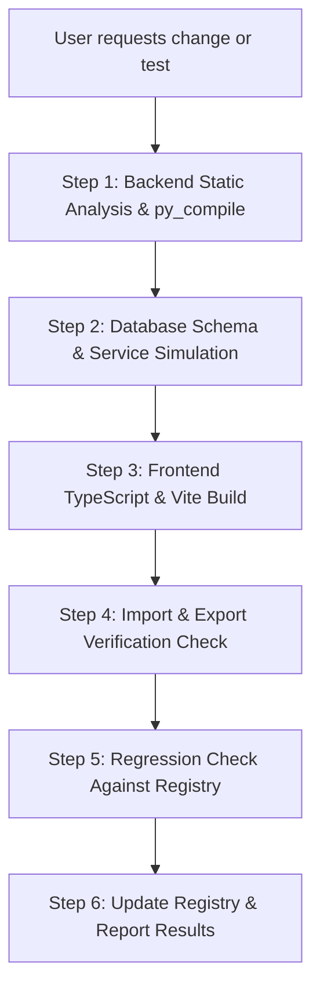

# Yinglima ERP — Master Module Feature & Regression Testing Registry

> **Document Code:** `YINGLIMA-REGISTRY-v2.1`  
> **System:** Yinglima ERP (`Yinglima_ERP`)  
> **Target Audience:** Developers, QA Engineers, and Autonomous AI Assistants  
> **Golden Principle:** **Zero Regression Guarantee.** No update or modification to any module may break, alter, or regress any feature, field, form, import/export mechanism, or validation rule cataloged in this document. Whenever the user requests to **"test"**, this registry serves as the strict checklist to verify.

---

## Table of Contents

1. [Executive Testing Principles & Continuous Sync Policy](#1-executive-testing-principles--continuous-sync-policy)
2. [Master Module Sitemap](#2-master-module-sitemap)
3. [Module 1: CONTACT — Suppliers Module (`/suppliers`)](#3-module-1-contact--suppliers-module-suppliers)
4. [Module 2: CONTACT — Buyers Module (`/buyers`)](#4-module-2-contact--buyers-module-buyers)
5. [Module 3: INVENTORY — Product Master (`/masters/products`)](#5-module-3-inventory--product-master-mastersproducts)
6. [Module 4: INVENTORY — Product Gallery (`/product-gallery`)](#6-module-4-inventory--product-gallery-product-gallery)
7. [Module 5: INVENTORY — Product Prices (`/inventory/product-prices`)](#7-module-5-inventory--product-prices-inventoryproduct-prices)
8. [Module 6: PURCHASE — Local Purchase & PDF Bill Extraction (`/purchase/local`)](#8-module-6-purchase--local-purchase--pdf-bill-extraction-purchaselocal)
9. [Module 7: SALE — Inquiries & RFQ (`/inquiries`)](#9-module-7-sale--inquiries--rfq-inquiries)
10. [Module 8: SALE — Sale Process & Official Trade Export (`/sale-process`)](#10-module-8-sale--sale-process--official-trade-export-sale-process)
11. [Module 9: PLANNING — Master Shipment Planning Grid (`/planning`)](#11-module-9-planning--master-shipment-planning-grid-planning)
12. [Module 10: USER MANAGEMENT — Users, Positions & RBAC (`/users`, `/positions`, `/rbac`)](#12-module-10-user-management--users-positions--rbac-users-positions-rbac)
13. [Module 11: SETTINGS — Master Data Tables (12 Masters Import/Export)](#13-module-11-settings--master-data-tables-12-masters-importexport)
14. [Module 12: GOVERNANCE — Audit Log & Trash Recovery (`/audit`, `/trash`)](#14-module-12-governance--audit-log--trash-recovery-audit-trash)
15. [Master "When User Says Test" Verification Protocol](#15-master-when-user-says-test-verification-protocol)

---

## 1. Executive Testing Principles & Continuous Sync Policy

1. **Continuous Documentation Sync Policy (MANDATORY)**:
   - Whenever any developer, engineer, or AI agent modifies, adds, or fixes code in Yinglima ERP (e.g. adding a new field, changing an import rule, adjusting a calculation), **THIS DOCUMENT MUST BE UPDATED IN THE SAME SESSION**.
   - This ensures the registry never becomes stale and guarantees full operational memory across sessions.
2. **The Regression Trap Protection**:
   - In past iterations, fixing one feature (e.g. phone duplicate check) caused unexpected side-effects in another (e.g. marking untouched records as updated during Excel import). Every code change MUST be validated against this registry.
3. **Dual-Mode Import Integrity**:
   - **Mode 1 ("Add New Records Only")**: Strictly rejects/skips existing records matching unique identifiers.
   - **Mode 2 ("Update / Modify Existing Records")**: 
     - **Zero Data Loss**: Blank cells in Excel/CSV must NEVER overwrite or delete existing non-blank database fields.
     - **Smart Diff**: Only records with actual, genuine modifications must be counted as **Updated**. Untouched records MUST be reported as **Unchanged**.
     - **Self-Identity Phone Exemption**: An existing record's own phone numbers must NEVER trigger a false duplicate collision against itself when re-importing.
4. **Multi-Link Tag Integrity**:
   - URL and Link fields (Websites, Factory Videos, Google Drive, OneDrive) must support multi-entry tags (separated by commas or Enter), display formatted clickable badges, and open targets in a new tab (`target="_blank"`).
5. **Media Persistence**:
   - Deleting photos or visit media must commit directly to PostgreSQL without triggering unrelated master reference validation errors (e.g., legacy category/brand reference errors). Deletions must persist across browser refreshes.

---

## 2. Master Module Sitemap

| # | Module Name | Route URL | Purpose | Import / Export Capabilities |
|---|---|---|---|---|
| 1 | **Suppliers** | `/suppliers` | Vendor management | **Dual-Mode Import (XLSX/CSV)**, Smart Diff, Full Export |
| 2 | **Buyers** | `/buyers` | Customer accounts | **Dual-Mode Import (XLSX/CSV)**, Smart Diff, Full Export |
| 3 | **Product Master** | `/masters/products` | SKU & catalog registry | **Import (XLSX/CSV)** with Master Validation, Full Export |
| 4 | **Product Gallery** | `/product-gallery` | Visual catalog & media | Photo Deletion Persistence, Storage Fallback Cards |
| 5 | **Product Prices** | `/inventory/product-prices`| Multi-currency pricing | **Export (XLSX/CSV)** of Supplier Quotations & Comparisons |
| 6 | **Local Purchase** | `/purchase/local` | Domestic procurement | **PDF Bill AI/OCR Extraction**, Purchase Bill Export / Print |
| 7 | **Inquiries** | `/inquiries` | Sales inquiries / RFQ | RFQ Export, Quotation Generation |
| 8 | **Sale Process** | `/sale-process` | Trade order execution | **Commercial Invoice (CI) Export (XLSX/PDF)**, Packing List |
| 9 | **Shipment Planning** | `/planning` | Logistics & containerization | Container Load Plan & Packing List Export (XLSX/PDF) |
| 10 | **User Management** | `/users` | Identity & access | Spoke user provisioning, Role & Position binding |
| 11 | **Positions** | `/positions` | Organizational hierarchy | Position reporting tree, Department mapping |
| 12 | **Departments & RBAC**| `/rbac` | Permissions matrix | Granular CRUD permission toggles per role |
| 13 | **Settings: Masters** | `/masters/*` | 12 Auxiliary masters | **Standardized Import & Export (XLSX/CSV)** for all 12 |
| 14 | **Audit Log** | `/audit` | System compliance | Immutable change tracking with actor, timestamp, diff |
| 15 | **Trash & Recovery** | `/trash` | Soft-delete recycle bin | Restore or permanent purge of soft-deleted records |

---

## 3. Module 1: CONTACT — Suppliers Module (`/suppliers`)

### 3.1. Form Fields Specification (Full Add / Edit Modal & Quick Add)

| Field Label in UI | Database Column | Type / Component | Options / Master Source | Mandatory | Behavior & Verification Notes |
|---|---|---|---|---|---|
| **Company Name** | `company_name` | Text / Typeahead (`SearchableDropdown`) | Independent unique | **YES** | **Typeahead & Duplicate Prevention:** While typing, shows matching existing suppliers under `EXISTING SIMILAR SUPPLIERS` with type badges (e.g. `manufacturer`, `dealer / trader`) so user avoids creating duplicates by mistake. Provides `Use "<Typed>" (New)` with `↵ Enter` badge. Pressing `Enter` or clicking immediately accepts custom name and closes dropdown. Displays non-blocking inline reminder (`ℹ️ Similar in Master:`) without covering fields. Blocks saving if an exact duplicate exists (`⛔ Supplier already exists`). |
| **Product Category (multiple)** | `category_links` | Multi-select pills | `/masters/product-categories` | No | Links multiple product categories. Checked via `SupplierCategoryLink`. |
| **Key Strength Sub-Category (multiple)** | `sub_category_links` | Multi-select pills | `/masters/product-sub-categories`| No | Filtered by selected categories. Checked via `SupplierSubCategoryLink`. |
| **Products Supplied (multiple)** | `product_links` | Multi-select pills | `/masters/products` | No | Links specific products/SKUs supplied by this factory. |
| **Brand Description / Capabilities** | `brand_description` | Textarea | — | No | Notes on manufacturing capabilities, brand names, OEM capacity. |
| **Supplier Type** | `supplier_type` | Select Dropdown | `/masters/supplier-types` | No | e.g. Manufacturer, Dealer/Trader, Wholesaler. |
| **Country** | `country_id` | Select Dropdown | `/masters/countries` | **YES** | Loads country dial code (defaults to China `+86`). |
| **State / Province** | `state_id` | Select / Text | `/masters/states` | **YES** | Scoped to Country; supports manual add if missing. |
| **City** | `city_id` | Select / Text | `/masters/cities` | **YES** | Scoped to State; supports manual add if missing. |
| **Town / Industrial Zone** | `town` | Text Input | — | No | Industrial park or town name. |
| **Address** | `address` | Textarea | — | No | Complete physical plant address. |
| **Primary Website** | `primary_website` | Multi-tag input (`TagInput`) | — | No | Multiple URLs separated by commas. Opens external link on click. |
| **Secondary Website / Alibaba** | `secondary_website` | Text Input | — | No | Alibaba, Made-in-China, or secondary site link. |
| **Factory Video / Inspection Folder Link** | `visit_media` | Multi-tag input (`VideoTagInput`)| — | No | **NEW FEATURE:** Supports multiple URLs separated by commas. Detects YouTube (`▶️`), Google Drive (`📁`), OneDrive (`📂`), Video (`🎥`) pills. Clickable, opens in new tab (`target="_blank"`). |
| **Primary Contact Person Name** | `contacts[0].person_name` | Text Input | — | No | Automatically synced to primary contact in `supplier_contacts`. |
| **Designation** | `contacts[0].designation` | Text Input | — | No | Job title (e.g. Sales Director, Overseas Manager). |
| **Calling Number** | `contact_calling_number` | Phone Input | Auto country dial code | No | Validated format (7–15 digits). |
| **WhatsApp Number** | `contact_whatsapp_number`| Phone Input | "Same as Calling" checkbox | No | Auto-copies from calling number if checked. |
| **WeChat Number** | `contact_wechat_number` | Text Input | "Same as Calling" checkbox | No | WeChat ID or mobile number. |
| **Email IDs (Multiple)** | `emails` | TagInput (`SupplierEmail`) | — | No | Enter email + comma/Enter. Stores list of emails. |
| **Tax ID Number** | `tax_id_number` | Text Input | — | No | Unified Social Credit Code or GST Number. |
| **Current Status** | `current_status` | Select Dropdown | `New`, `Existing` | No | **1-Way Lock:** Cannot revert from `Existing` back to `New`. |
| **Supplier Grade** | `supplier_grade` | Select Dropdown | `Grade A`, `Grade B`, `Grade C`, `Premium` | No | Quality rating. |
| **Potential** | `potential` | Select Dropdown | `Yes`, `No` | No | Prospective future supplier indicator. |
| **Potential Reason** | `potential_reason` | Textarea | — | No | Required if Potential is set to `Yes`. |
| **Visited Factory / Office** | `visited_factory_office` | Select / Radio | `Yes`, `No` | No | Flag indicating in-person plant inspection. |
| **Visit Remarks** | `visit_remarks` | Textarea | — | No | Notes from factory inspection. |
| **Overall Remarks** | `overall_remarks` | Textarea | — | No | General internal procurement remarks. |
| **Visit Photos / Media Upload** | `visit_media` | File Uploader | Supabase Storage / Local Disk | No | Supports uploading JPG/PNG inspection photos with delete option. |

### 3.2. Core CRUD Lifecycle Checklist
- [ ] **Add Supplier**: Submitting with all fields creates the record, establishes category/product linkages, and adds primary contact.
- [ ] **View Supplier**: Clicking row opens Side Detail Drawer displaying all badges, categorization pills, products supplied, contact details, and clickable website/video pills.
- [ ] **Edit Supplier**: All existing values load into the form; editing fields (including Video links and Products Supplied) saves properly without wiping empty fields.
- [ ] **Delete Supplier**: Only allowed if `current_status != 'existing'` and `potential != 'yes'`. Soft-deletes to Trash (`is_deleted = true`).

### 3.3. Import & Export Specification & Verification Checklist
- [ ] **Export Test (XLSX & CSV)**:
  - Headers: `Company Name`, `Product Categories`, `Key Strength Sub-Categories`, `Products Supplied`, `Secondary Products`, `Country`, `State / Province`, `City`, `Brand Description`, `Supplier Type`, `Current Status`, `Supplier Grade`, `Potential`, `Potential Reason`, `Contact Person`, `Designation`, `Calling Number`, `WhatsApp Number`, `WeChat Number`, `Emails`, `Tax ID / GST Number`, `Address`, `Town`, `Primary Website`, `Secondary Website`, `Visited Factory/Office`, `Visit Remarks`, `Overall Remarks`, `Status`.
  - Verify exported file has correct row count and all multi-value fields (categories, products, emails) properly comma-separated.
- [ ] **Import Mode 1 ("Add New Records Only") Test**:
  - Rejects/skips any row whose Company Name already exists in the database.
- [ ] **Import Mode 2 ("Update / Modify Existing Records" - Smart Diff) Test**:
  - **Zero Data Loss**: Blank cells in Excel are ignored and never erase existing fields.
  - **Accurate Smart Diff**: Modifying only 1 supplier (e.g. changing Brand Description of `JDPacking` to `good`) results in:
    - **`Updated: 1`**
    - **`Unchanged: 9`**
    - **`Failed: 0`**
  - **Relationship Accuracy**: Does not falsely flag unchanged categories/sub-categories as updated.
  - **Self-Phone Exemption**: A supplier's own existing phone numbers in Excel do not trigger duplicate collisions.
  - **Summary Panel**: Accurately displays Total Rows, Created, Updated, Unchanged, and Failed counters.

---

## 4. Module 2: CONTACT — Buyers Module (`/buyers`)

### 4.1. Form Fields Specification

| Field Label in UI | Database Column | Type / Component | Options / Master Source | Mandatory | Behavior & Verification Notes |
|---|---|---|---|---|---|
| **Company Name** | `company_name` | Text Input | Independent unique | **YES** | Strict uniqueness. Triggers instant red blocker on duplicate. |
| **Buyer Type** | `buyer_type` | Select Dropdown | `/masters/buyer-types` | No | e.g. Importer, Distributor, End User. |
| **Product Categories** | `category_links` | Multi-select pills | `/masters/product-categories` | No | Primary products customer purchases. |
| **Sub Categories** | `sub_category_links`| Multi-select pills | `/masters/product-sub-categories`| No | Sub-categories of interest. |
| **Country** | `country_id` | Select Dropdown | `/masters/countries` | **YES** | Defaults to India (`+91`) or China (`+86`). |
| **State / Province** | `state_id` | Select / Text | `/masters/states` | **YES** | Scoped to country. |
| **City** | `city_id` | Select / Text | `/masters/cities` | **YES** | Scoped to state. |
| **Address** | `address` | Textarea | — | No | Billing / shipping business address. |
| **Primary Contact Person**| `contact_full_name`| Text Input | — | No | Main buyer contact representative. |
| **Designation** | `contact_designation` | Text Input | — | No | Job position. |
| **Calling Number** | `contact_calling_number`| Phone Input | Country code prefix | No | Validated digits; 3-way collision protection. |
| **WhatsApp Number** | `contact_whatsapp_number`| Phone Input | "Same as Calling" checkbox | No | Auto-syncs from calling if checked; 3-way collision check. |
| **Email IDs (Multiple)** | `emails` | TagInput (`BuyerEmail`) | — | No | Enter email + comma/Enter. |
| **Tax ID / GST Number** | `tax_id_number` | Text Input | — | No | GSTIN / Tax Identification. |
| **Primary Website** | `primary_website` | Multi-tag input (`TagInput`) | — | No | Clickable URL pills opening in a new tab. |
| **Secondary Website** | `secondary_website` | Text Input | — | No | Secondary portal / trade directory link. |
| **Current Status** | `current_status` | Select Dropdown | `New`, `Existing` | No | 1-way lock: cannot revert `Existing` $\rightarrow$ `New`. |
| **Buyer Grade** | `buyer_grade` | Select Dropdown | `Grade A`, `Grade B`, `Grade C`, `Premium` | No | Client credit/volume tier. |
| **Potential** | `potential` | Select Dropdown | `Yes`, `No` | No | Future deal conversion indicator. |
| **Potential Reason** | `potential_reason` | Textarea | — | No | Required if Potential is `Yes`. |
| **Product Range / Requirements** | `product_range` | Textarea | — | No | Specific machinery or materials buyer inquires about. |
| **Currently Buying From**| `currently_buying_from`| Textarea | — | No | Competitor or existing supply chain vendor notes. |
| **Remarks** | `overall_remarks` | Textarea | — | No | Sales notes & customer preferences. |

### 4.2. Import & Export Specification & Verification Checklist
- [ ] **Export Test (XLSX & CSV)**:
  - Generates full buyer file with Company Name, Categories, Country, State, City, Contact Person, Calling, WhatsApp, Emails, Websites, Potential, Remarks.
- [ ] **Import Mode 1 ("Add New Records Only") Test**:
  - Rejects if Company Name, Calling Number, or WhatsApp Number already belongs to another Buyer.
- [ ] **Import Mode 2 ("Update / Modify Existing Records" - Smart Diff) Test**:
  - **Self-Phone Protection**: Updating an existing Buyer with their own existing phone number does NOT trigger a false collision.
  - **Smart Diff**: Re-importing buyer file with 1 changed field results in `Updated: 1`, `Unchanged: N-1`, `Failed: 0`.

---

## 5. Module 3: INVENTORY — Product Master (`/masters/products`)

### 5.1. Form Fields Specification

| Field Label in UI | Database Column | Type / Component | Options / Master Source | Mandatory | Behavior & Verification Notes |
|---|---|---|---|---|---|
| **Product Code / SKU** | `product_code` | Text Input | Unique code | **YES** | System or user SKU (e.g. `INH-00183`, `AUTO-21025`). |
| **Product Name** | `product_name` | Text Input | — | **YES** | Primary internal catalog name. |
| **Product Name (Tally / Accounting)** | `product_name_tally` | Text Input | — | No | Synchronized accounting name for invoices. |
| **Product Category** | `category_id` | Select Dropdown | `/masters/product-categories` | **YES** | Must exist in Category Master. |
| **Product Sub-Category**| `sub_category_id` | Select Dropdown | `/masters/product-sub-categories`| No | Scoped to chosen Category. |
| **Brand** | `brand_id` | Select Dropdown | `/masters/brands` | No | Machine manufacturer or proprietary brand. |
| **Unit of Measurement** | `uom_id` | Select Dropdown | `/masters/uom` | **YES** | e.g. PCS, SET, NOS, KG. |
| **HSN Code** | `hsn_id` | Select Dropdown | `/masters/hsn` | No | Harmonized System 6–8 digit code with GST rate. |
| **Standard Cost Price** | `standard_cost_price` | Numeric Input | — | No | Baseline procurement cost. |
| **Standard Selling Price**| `standard_selling_price`| Numeric Input| — | No | Target catalog export sale price. |
| **Product Images** | `images` | Multi-image uploader | Supabase / Local disk | No | Image array (`images: []`). |
| **Technical Specs** | `specifications` | JSON / Key-Value | — | No | Power, capacity, speed, dimensions. |
| **Description** | `description` | Textarea | — | No | Full catalog marketing text. |

### 5.2. Import & Export Specification & Verification Checklist
- [ ] **Export Test (XLSX & CSV)**:
  - Exports Product Code, Product Name, Tally Name, Category, Sub-Category, Brand, UOM, HSN Code, Cost Price, Selling Price, Description.
- [ ] **Import Test (XLSX & CSV)**:
  - Validates that Category, Sub-Category, Brand, UOM, and HSN exist in their respective Masters.
  - Matches records by `product_code` (SKU).
  - Skips or reports errors if referenced master entities are missing or invalid.

---

## 6. Module 4: INVENTORY — Product Gallery (`/product-gallery`)

### 6.1. Visual Architecture & Capabilities
- **Filter Bar**: Search by SKU / Name, Category filter, Sub-Category filter, Supplier filter.
- **Card Grid**: Renders high-resolution product images, SKU pill, Brand, Supplier name, and action menu.
- **Photo Deletion Engine**:
  - Each image card has a delete (`🗑️`) button.
  - When clicked, immediately updates `product.images` via `PATCH /masters/products/{id}`.
  - **Persistence Guarantee**: Bypasses full relational reference re-validation, commits directly to PostgreSQL, updates local state, and stays deleted upon page refresh.
- **Broken Image Fallback**:
  - If Supabase cloud storage limits or expired billing return `HTTP 402` or broken links, image card renders an elegant fallback: *"Image Unavailable (Storage Expired)"*.
  - Provides a 1-click **"Remove Broken Image"** button to clean bad URLs from the database.

### 6.2. Verification Checklist
- [ ] Open Product Gallery (`/product-gallery`).
- [ ] Delete a product photo $\rightarrow$ Confirm card disappears immediately.
- [ ] Refresh the page (`F5`) $\rightarrow$ Confirm the deleted image **does NOT return**.
- [ ] Verify broken images display clean fallback cards without breaking table layout.

---

## 7. Module 5: INVENTORY — Product Prices (`/inventory/product-prices`)

### 7.1. Form Fields & Capabilities
- **Supplier Quotations**: Tracks price quotations given by different suppliers for the same SKU.
- **Fields**: Product SKU, Supplier Name, Quoted Currency (USD, CNY, INR, EUR), Unit Price, MoQ (Minimum Order Quantity), Lead Time (Days), Valid Until Date, Quotation Document Attachment.
- **Price History & Comparison**: Side-by-side comparison of supplier quotes to select the best vendor.
- **Export Test**:
  - Verify clicking Export generates XLSX/CSV containing all quotation columns, supplier names, currencies, and prices.

---

## 8. Module 6: PURCHASE — Local Purchase & PDF Bill Extraction (`/purchase/local`)

### 8.1. Form Fields Specification

| Field Label in UI | Database Column | Type / Component | Options / Master Source | Mandatory | Behavior & Verification Notes |
|---|---|---|---|---|---|
| **Purchase Order / Bill No.** | `bill_number` | Text Input | Unique per vendor | **YES** | Vendor invoice or domestic bill number. |
| **Supplier** | `supplier_id` | Searchable Dropdown | `/suppliers` | **YES** | Domestic vendor providing materials/services. |
| **Bill Date** | `bill_date` | Date Picker | ISO Date | **YES** | Invoice issuance date. |
| **Due Date** | `due_date` | Date Picker | ISO Date | No | Payment maturity date. |
| **Currency** | `currency_code` | Select Dropdown | `INR`, `USD`, `CNY` | **YES** | Defaults to `INR` for local purchases. |
| **PDF Bill Upload** | `bill_file_url` | File Uploader (PDF) | PDF / Image | No | **PDF BILL EXTRACTION ENGINE** runs on upload. |
| **Line Items Grid** | `items` | Dynamic Table | Product Master | **YES** | Product SKU, Description, HSN, Quantity, Unit Rate, GST %, Total Amount. |
| **Total Amount (Pre-Tax)** | `subtotal` | Calculated Numeric | Auto-calculated | **YES** | Sum of `quantity * unit_rate`. |
| **Total Tax (CGST + SGST / IGST)**| `tax_total` | Calculated Numeric | Auto-calculated | **YES** | Tax sum based on line item GST %. |
| **Grand Total** | `grand_total` | Calculated Numeric | Auto-calculated | **YES** | `subtotal + tax_total`. |
| **Payment Status** | `payment_status` | Select Dropdown | `Unpaid`, `Partially Paid`, `Paid` | **YES** | Payment tracking. |
| **Notes / Remarks** | `notes` | Textarea | — | No | Domestic procurement notes. |

### 8.2. PDF Bill Extraction Engine & Export Verification Checklist
- [ ] **Upload PDF Bill Test**:
  - Drag and drop vendor PDF bill into the uploader.
  - Verify extraction automatically pre-fills:
    - Bill Number, Bill Date, Supplier Name.
    - Line items with quantities, rates, and tax calculations.
- [ ] **Export & Print Test**:
  - Verify purchase bills can be exported or printed with itemized tax breakdowns.

---

## 9. Module 7: SALE — Inquiries & RFQ (`/inquiries`)

### 9.1. Fields & Capabilities
- **Inquiry Number**: Auto-generated sequential identifier.
- **Buyer**: Linked buyer from Buyer Master.
- **Inquiry Date**: Date inquiry was received.
- **Product Requirement List**: SKUs requested, Target Price, Expected Delivery Date.
- **Status Pipeline**: `New` $\rightarrow$ `Under Review` $\rightarrow$ `Quotation Sent` $\rightarrow$ `Converted to Order` $\rightarrow$ `Closed / Lost`.
- **1-Click Conversion**: Converts inquiry directly into Proforma Invoice / Sale Process order.
- **Export Test**: Verify export produces complete inquiry list with buyer names and statuses.

---

## 10. Module 8: SALE — Sale Process & Official Trade Export (`/sale-process`)

### 10.1. Export Trade Order Execution
- **Milestones**: Lead $\rightarrow$ Quotation $\rightarrow$ Proforma Invoice (PI) $\rightarrow$ Commercial Invoice (CI) $\rightarrow$ Payment $\rightarrow$ Shipment.
- **Official Commercial Invoice (CI) Export Engine**:
  - Generates official export trade documents with standard trade headers:
    - **Exporter / Consignor**: Company legal name, address, Tax ID.
    - **Buyer / Consignee**: Full buyer address, GST/Tax ID, Contact person.
    - **Country of Origin**: e.g., China / India.
    - **Country of Final Destination**: Buyer's destination country.
    - **Port of Loading** & **Port of Discharge**.
    - **Terms of Delivery & Payment**: e.g., FOB Shanghai, CIF Nhava Sheva, 30% Advance 70% against BL copy.
    - **Itemized Table**: Marks & Nos, Container No, No. of Packages, Description of Goods, HSN Code, Quantity, Unit Rate, Total Amount.
- **Verification Checklist**:
  - [ ] Generate Commercial Invoice in XLSX/PDF $\rightarrow$ Verify all trade headers and consignee details are populated without blank placeholders.
  - [ ] Generate Packing List in XLSX/PDF $\rightarrow$ Verify carton counts, weights, and dimensions match order.

---

## 11. Module 9: PLANNING — Master Shipment Planning Grid (`/planning`)

### 11.1. Capabilities & Calculations
- **Container Sizing**: 20ft GP (33 CBM), 40ft GP (67 CBM), 40ft HQ (76 CBM).
- **Automated CBM Calculation**: `(Length(cm) * Width(cm) * Height(cm) / 1,000,000) * Number of Cartons`.
- **Weight Check**: Gross Weight vs Net Weight vs Maximum Container Payload.
- **Export Test**:
  - Verify exporting shipment plan produces container utilization sheet with CBM%, weights, and carton packing summary.

---

## 12. Module 10: USER MANAGEMENT — Users, Positions & RBAC (`/users`, `/positions`, `/rbac`)

### 12.1. User Management & Deprovisioning
- **User Creation & Roles**: Full Name, Email, Password, Assigned Department, Position, Is Active toggle.
- **Spoke Deprovisioning Protocol**:
  - When access is revoked from `ERP_Main` (control plane), the user is soft-deleted on `Yinglima_ERP` and active sessions are terminated.
- **Granular RBAC (`/rbac`)**:
  - Matrix of permissions (Create, Read, Update, Delete, Import, Export) across every module.
  - Changes save instantly to PostgreSQL and enforce on backend route dependencies (`require_permission`).

---

## 13. Module 11: SETTINGS — Master Data Tables (12 Masters Import/Export)

Every master table adheres to strict standardized CRUD, search, pagination, unique constraints, and **generic Import/Export via `import_export.py`**:

| # | Master Table | Route URL | Unique Key | Foreign Key Dependencies | Export Supported | Import Supported |
|---|---|---|---|---|---|---|
| 1 | **Cities** | `/masters/cities` | City Name + State | `country_id`, `state_id` | **YES (XLSX/CSV)** | **YES (XLSX/CSV)** |
| 2 | **Provinces / States**| `/masters/states` | State Name + Country | `country_id` | **YES (XLSX/CSV)** | **YES (XLSX/CSV)** |
| 3 | **Countries** | `/masters/countries`| Country Name / ISO Code | — | **YES (XLSX/CSV)** | **YES (XLSX/CSV)** |
| 4 | **Currencies** | `/masters/currencies`| Currency Code (USD/INR)| — | **YES (XLSX/CSV)** | **YES (XLSX/CSV)** |
| 5 | **Units of Measurement**| `/masters/uom` | UOM Name / Abbrev | — | **YES (XLSX/CSV)** | **YES (XLSX/CSV)** |
| 6 | **HSN Codes** | `/masters/hsn` | HSN 6–8 Digit Code | — | **YES (XLSX/CSV)** | **YES (XLSX/CSV)** |
| 7 | **Product Categories**| `/masters/categories`| Category Name / Code | — | **YES (XLSX/CSV)** | **YES (XLSX/CSV)** |
| 8 | **Product Sub-Categories**|`/masters/subcategories`| Sub-Category Name | `category_id` | **YES (XLSX/CSV)** | **YES (XLSX/CSV)** |
| 9 | **Brands** | `/masters/brands` | Brand Name | Country (optional) | **YES (XLSX/CSV)** | **YES (XLSX/CSV)** |
| 10 | **Supplier Types** | `/masters/supplier-types`| Type Name | — | **YES (XLSX/CSV)** | **YES (XLSX/CSV)** |
| 11 | **Buyer Types** | `/masters/buyer-types` | Type Name | — | **YES (XLSX/CSV)** | **YES (XLSX/CSV)** |
| 12 | **Company List** | `/masters/company-list` | Legal Company Name | — | **YES (XLSX/CSV)** | **YES (XLSX/CSV)** |

### 13.1. Master Import/Export Verification Checklist
- [ ] **Export Test**: Verify exporting any master table yields correctly ordered columns matching UI grid.
- [ ] **Import Validation Test**: Verify importing checks foreign key existence (e.g. Sub-Category import rejects if Category doesn't exist; City import rejects if State doesn't exist).
- [ ] **Duplicate Blocker**: Verify importing duplicates reports exact row numbers and error details.

---

## 14. Module 12: GOVERNANCE — Audit Log & Trash Recovery (`/audit`, `/trash`)

### 14.1. Audit Log (`/audit`)
- Captures Actor, Action (`CREATE`, `UPDATE`, `DELETE`, `IMPORT`), Entity Name, Entity ID, Timestamp, IP Address, and Change Delta (old values vs new values).
- Filterable by date range, user, action type, and search keyword.

### 14.2. Trash & Recovery (`/trash`)
- All soft-deleted records across Suppliers, Buyers, Products, and Inquiries appear in Trash.
- **Restore Action**: Restores record to active state (`is_deleted = false`).
- **Permanent Delete**: Permanently removes record only if permitted by superadmin.

---

## 15. Master "When User Says Test" Verification Protocol

Whenever the user asks to **"test this"**, **"verify"**, or before concluding any task on Yinglima ERP, follow this **Strict 6-Step Protocol**:



### Step 1: Backend Static Analysis
Run Python compilation on all modified services, schemas, and routes:
```powershell
.venv\Scripts\python.exe -m py_compile app/suppliers/service.py app/suppliers/schemas.py app/buyers/service.py
```
*Must return exit code 0.*

### Step 2: Database & Service Simulation
If import, duplicate, or calculation logic was modified, run an automated script simulating the exact action:
- Test Export $\rightarrow$ Verify all columns populated.
- Test Import Update Mode with 1 modified row $\rightarrow$ Must return `updated: 1`, `unchanged: N-1`, `failed: 0`.
- Test Duplicate Phone Check $\rightarrow$ Must verify that existing records do not collide with themselves.

### Step 3: Frontend Build
Run frontend compilation:
```powershell
cd d:\Om work1\ERP\Yinglima_ERP\frontend
npm run build
```
*Must complete with `✓ built in Xs` and 0 TypeScript errors.*

### Step 4: Import & Export Verification Check (MANDATORY IF MODULE SUPPORTS IMPORT/EXPORT)
- **Export Test**: Trigger export (XLSX / CSV) and verify:
  1. File is generated without 500 error.
  2. All standard headers and relational values (categories, products, phones, emails) are correctly formatted.
- **Import Mode 1 ("Add New Records Only") Test**:
  1. Upload duplicate record $\rightarrow$ Verify it is rejected / flagged as duplicate.
  2. Upload valid new record $\rightarrow$ Verify it is added (`created: 1`).
- **Import Mode 2 ("Update / Modify Existing Records" - Smart Diff) Test**:
  1. Upload file with 1 changed record $\rightarrow$ Verify **`updated: 1`**, **`unchanged: N-1`**, **`failed: 0`**.
  2. Confirm empty cells did NOT wipe existing database values.

### Step 5: Regression Check Against Registry
Review the specific module's checklist in this document to verify:
- All form fields render.
- Multi-link tag components render clickable pills.
- Modals, drawers, and delete actions function without breaking.

### Step 6: Continuous Registry Sync & Final Report
1. **Sync Registry**: If any new field, route, or logic was altered, update **`YINGLIMA_MODULE_FEATURE_AND_TESTING_REGISTRY.md`** immediately.
2. **Present Results**:
   - Exact issue identified.
   - Root cause explanation.
   - Solution applied.
   - Exact simulation results (e.g. `1 Updated, 9 Unchanged, 0 Failed`).
   - Reiteration: **No code pushed to GitHub without explicit user command.**
