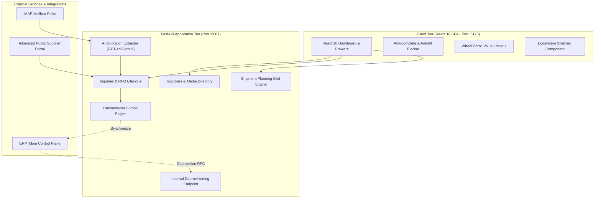

# Yinglima_ERP — System Architecture & Design Specification

**System Role:** China Sourcing, Procurement, Vendor Quotations & Master Shipment Planning  
**Architecture Type:** Modular Async Monolith (FastAPI) + React 18 SPA (Vite) + Outbox Engine  
**Database:** PostgreSQL (Supabase Cloud Pooler / Dedicated Database Schema)  
**Location:** `Yinglima_ERP/`

---

## 1. System Topology & Architectural Pattern

`Yinglima_ERP` powers China vendor procurement, automated quotation extraction, RFQ management, and container shipment planning.



---

## 2. Core Domain Architectures

### 2.1 Suppliers & Factory Media Directory
- Vendor catalog tracking Chinese suppliers, factory locations, English/Chinese names, WeChat/WhatsApp contacts, bank accounts, and tax numbers.
- Factory visit media persistent storage (photos, inspection videos) via Supabase Storage.

### 2.2 Inquiries, RFQs & AI Quotation Extractor
- Inbound IMAP email poller monitoring supplier responses to RFQs.
- **Zero Wasted API Calls:** First supplier reply triggers AI extraction; subsequent negotiation emails bypass AI and append directly to the email timeline.
- Dynamic quotation matrix comparing multi-vendor pricing, lead times, MOQ, and terms.
- Public tokenized submission portal for direct vendor quote input without ERP login.

### 2.3 Master Shipment Planning Grid Engine
- Dynamic spreadsheet-like planning grid for container optimization (20GP, 40GP, 40HQ, 45HQ).
- Automated CBM and gross weight calculations with status tagging per cell/row.

### 2.4 Transactional Outbox Engine
- Guaranteed event delivery to `ERP_Main` for global reporting and projections without two-phase commit overhead.

---

## 3. Frontend Architecture & Platform Hardening

### 3.1 Global Autocomplete & Autofill Blocker (`lib/autocompleteBlocker.ts`)
- Continuously enforces `autocomplete="off"`, `autocapitalize="off"`, `spellcheck="false"`, `data-lpignore="true"` (LastPass blocker), and `data-form-type="other"` (heuristics disabler) across all DOM elements via a `MutationObserver`.
- Capture-phase `focusin` listener intercepts user interactions before browser suggestion popups render, permanently suppressing floating suggestion bubbles.

### 3.2 Wheel Scroll Value Lockout & Spin-Button Elimination
- Document-level passive `wheel` listener blurs `input[type="number"]` elements on mouse wheel scroll.
- Universal CSS removes webkit outer/inner spin buttons and sets `-moz-appearance: textfield`.

### 3.3 SSO Handover & Identity Preservation
- `ssoBridge.ts` passes the active authenticated user's email and first name during ERP switching, preventing unintended admin fallback.

---

## 4. Directory Layout

```
Yinglima_ERP/
├── backend/
│   ├── app/
│   │   ├── suppliers/            # Supplier directory & visit media
│   │   ├── inquiries/            # Inquiries, RFQs, quotation comparison
│   │   ├── planning/             # Container shipment planning sheets
│   │   ├── email_poller/         # IMAP inbound quote poller
│   │   ├── quotation_extractor/  # AI extraction pipeline (OpenAI/Gemini)
│   │   ├── outbox/               # Transactional outbox publisher
│   │   └── api/v1/internal_users.py # Spoke user deprovisioning endpoint
│   ├── alembic/                  # Database migrations
│   └── tests/                    # Backend test suites
├── frontend/
│   ├── src/
│   │   ├── components/           # EcosystemSwitcher, UI tokens
│   │   ├── lib/                  # autocompleteBlocker.ts, ssoBridge.ts
│   │   ├── pages/                # Suppliers, Inquiries, PlanningSheets
│   │   ├── App.tsx               # App lifecycle & blocker initialization
│   │   └── main.tsx              # Wheel scroll lockout listener
│   └── package.json
└── doc/                          # System documentation
```

---

## 5. Machine Identifiers vs. Dynamic Human Branding

To achieve complete decoupling between infrastructure routing and organizational branding:

1. **Unique Machine Identifier (`erp-02`):**
   - The backend instance identifier `ERP_INSTANCE_ID = "erp-02"` is defined in [`backend/app/core/config.py`](file:///c:/Users/Inhyma%20Solutions/OneDrive/Desktop/ERP/Yinglima_ERP/backend/app/core/config.py).
   - Used for inter-ERP service-to-service authentication, health reporting, and identity sync across the ecosystem.

2. **Public Branding Contract (`GET /organizations/public`):**
   - Unauthenticated endpoint serving `{ company_name, legal_name, logo_url, erp_id }`.
   - Allows client applications, login pages, and browser tab titles to resolve branding dynamically before authentication.

3. **Dynamic Single Source of Truth (`ERP Settings -> Company Name`):**
   - The human-facing brand name is never hardcoded in source files.
   - All frontend components, public supplier quotation pages, and sales order forms query `getCachedBrandName()`, which stays synchronized with the active record in the `organizations` database table.
