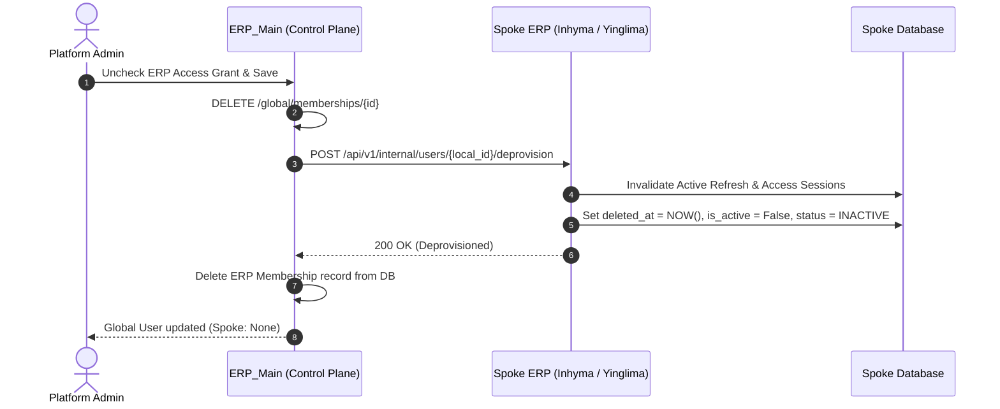

# Comprehensive ERP Ecosystem Changes & Features Documentation

**Date:** September 26, 2026  
**Ecosystem:** Distributed Multi-ERP Platform (`ERP_Main`, `Yinglima_ERP`, `Inhyma_ERP`)  
**Scope:** Identity Governance, Single ERP Direct Login, Spoke Deprovisioning, User & Data Isolation, and Ecosystem Switcher Optimization.

---

## 1. Executive Summary

Today's engineering initiatives resolved key user experience, governance, and identity isolation bottlenecks across the distributed ERP ecosystem:
1. **Simplified ERP Access Governance:** Retired the standalone, redundant "ERP Memberships" UI tab (`/access/memberships`). All ERP access permissions are now managed strictly and intuitively via the **ERP Access Grants** checkboxes in the Global User Create and Edit modals.
2. **Clean Status Visualization:** In the Global Users directory under `ERP'S ACCESS`, revoked or unassigned access states now cleanly render as **`None`** (e.g., `Inhyma: • None`) rather than confusing `Revoked` badges.
3. **True User Deprovisioning & Spoke Removal:** When an ERP access grant is unchecked, the system invokes automated deprovisioning on the spoke ERP via internal API. Active sessions are terminated and the user record is soft-deleted, removing them completely from the spoke ERP's local user table (`/users`) rather than leaving them in a lingering `Suspended` state.
4. **Conditional Navigation Architecture (Single ERP vs Multi-ERP Access):**
   - **Single ERP Users:** Automatically directed to their authorized ERP application upon login without displaying the ERP Dashboard or switcher controls.
   - **Multi-ERP Users (e.g., Alice Wonder):** Granted access to the central ERP Dashboard and presented with the topbar **Ecosystem Switcher** dropdown in all authorized ERP applications.
   - **Unassigned Users:** Remain safely on the central ERP Dashboard without spoke access until access is explicitly granted.
5. **Fixed Ecosystem Switcher Display for Multi-ERP Users:** Resolved a backend model attribute bug in `ecosystem_session.py` (`ErpInstance.erp_key` $\rightarrow$ `ErpInstance.key`), implemented proactive session synchronization in spoke ERP topbars, and ensured cross-ERP SSO tokens strictly preserve authenticated user identities without admin fallback.

---

## 2. Architectural Changes & Feature Implementations

### 2.1 Unified ERP Access Control & UI Simplification

Previously, administrators had to navigate between "Global Users" and a separate "ERP Memberships" page to link identities to spoke ERP instances.

#### Changes Made:
- **Removed ERP Memberships Navigation Tab:**
  - Updated [`ERP_Main/frontend/src/lib/nav.ts`](file:///c:/Users/Inhyma%20Solutions/OneDrive/Desktop/ERP/ERP_Main/frontend/src/lib/nav.ts): Reduced `ACCESS_SECTION_TABS` from 4 items to 3 (`Global Users`, `Roles`, `Permissions`).
  - Updated [`ERP_Main/frontend/src/App.tsx`](file:///c:/Users/Inhyma%20Solutions/OneDrive/Desktop/ERP/ERP_Main/frontend/src/App.tsx): Added route redirects from `/access/memberships` and `/memberships` directly to `/access/users`.
  - Updated [`NavigationStructure.test.tsx`](file:///c:/Users/Inhyma%20Solutions/OneDrive/Desktop/ERP/ERP_Main/frontend/src/tests/NavigationStructure.test.tsx) to validate the new 3-tab navigation bar.
- **Centralized Access Grants Modal:**
  - Renamed the section in Global User Create and Edit modals from `"Initial ERP Access Grants (Optional)"` to **`"ERP Access Grants"`**.
  - Added clear explanatory guidance: *"Select which ERP systems this user is granted access to. Removing access completely deprovisions and removes the user from that ERP."*
- **Badge Normalization (`Revoked` $\rightarrow$ `None`):**
  - Updated `renderErpAccessBadge` and `renderUserErpAccessCell` in [`GlobalUsers.tsx`](file:///c:/Users/Inhyma%20Solutions/OneDrive/Desktop/ERP/ERP_Main/frontend/src/pages/GlobalUsers.tsx).
  - Any user lacking access or whose access was removed now displays a neutral gray badge: `None` (e.g., `Inhyma: • None`), keeping the interface clear and uncluttered.

---

### 2.2 True User Deprovisioning & Spoke Removal

When an administrator revokes an ERP grant from the control plane, the user must be removed from the spoke ERP rather than remaining visible as `Suspended`.



#### Technical Implementation:
1. **Spoke ERP Deprovisioning Endpoints:**
   - Added `POST /api/v1/internal/users/{local_user_id}/deprovision` and `DELETE /api/v1/internal/users/{local_user_id}` in [`Yinglima_ERP/backend/app/api/v1/internal_users.py`](file:///c:/Users/Inhyma%20Solutions/OneDrive/Desktop/ERP/Yinglima_ERP/backend/app/api/v1/internal_users.py) and [`Inhyma_ERP/backend/app/api/v1/internal_users.py`](file:///c:/Users/Inhyma%20Solutions/OneDrive/Desktop/ERP/Inhyma_ERP/backend/app/api/v1/internal_users.py).
   - Revokes active sessions, sets `deleted_at = datetime.now(timezone.utc)`, `is_active = False`, and `status = UserStatus.INACTIVE`.
   - Enforces bootstrap admin protection: root admin (`admin@example.com` / `admin`) can never be deprovisioned or deleted.
2. **Soft-Delete Table Filtering in Spoke ERPs:**
   - Modified `UserRepository.search()` in spoke repositories ([`Yinglima_ERP/backend/app/users/repository.py`](file:///c:/Users/Inhyma%20Solutions/OneDrive/Desktop/ERP/Yinglima_ERP/backend/app/users/repository.py) and [`Inhyma_ERP/backend/app/users/repository.py`](file:///c:/Users/Inhyma%20Solutions/OneDrive/Desktop/ERP/Inhyma_ERP/backend/app/users/repository.py)) to use `self._base_select()` and filter `count_stmt.where(User.deleted_at.is_(None))`.
   - Deprovisioned users immediately disappear from the spoke ERP's user directory table (`/users`).
3. **Control Plane Adapter & Service Deletion:**
   - Updated [`adapters/base.py`](file:///c:/Users/Inhyma%20Solutions/OneDrive/Desktop/ERP/ERP_Main/backend/app/identity_linking/adapters/base.py) and [`adapters/http_adapter.py`](file:///c:/Users/Inhyma%20Solutions/OneDrive/Desktop/ERP/ERP_Main/backend/app/identity_linking/adapters/http_adapter.py) with `deprovision_local_user(erp, local_user_id, reason)`.
   - Added `delete()` method to [`ErpMembershipService`](file:///c:/Users/Inhyma%20Solutions/OneDrive/Desktop/ERP/ERP_Main/backend/app/erp_memberships/service.py) and route `DELETE /global/memberships/{membership_id}` in [`erp_memberships/routes.py`](file:///c:/Users/Inhyma%20Solutions/OneDrive/Desktop/ERP/ERP_Main/backend/app/erp_memberships/routes.py).
   - Updated `handleSaveEdit` in [`GlobalUsers.tsx`](file:///c:/Users/Inhyma%20Solutions/OneDrive/Desktop/ERP/ERP_Main/frontend/src/pages/GlobalUsers.tsx) to invoke `apiDelete` on uncheck.

---

### 2.3 Single ERP Direct Login & Multi-ERP Switcher Rules

The platform now enforces strict routing and switching behavior based on user authorizations:

| User Scenario | Assigned ERPs | Login Destination (`localhost:5170`) | ERP Switcher Dropdown | Spoke ERP Access |
| :--- | :--- | :--- | :--- | :--- |
| **Single ERP User** (e.g., John Doe) | Yinglima Only | **Directly redirects to Yinglima** (`:5173/dashboard`) | **Hidden** | Yinglima Only (Inhyma: None) |
| **Multi-ERP User** (e.g., Alice Wonder) | Yinglima + Inhyma | **ERP Dashboard** (`:5170/dashboard`) | **Visible** in all apps | Both Yinglima and Inhyma |
| **Platform Super Admin** | All ERPs (`*`) | **ERP Dashboard** (`:5170/dashboard`) | **Visible** (Full Fleet) | Full Root Access |
| **Unassigned User** (e.g., test12333) | None | **ERP Dashboard** (`:5170/dashboard`) | **Hidden** | None (Access Pending) |

#### Implementation Details:
- **Central Control Plane Login Routing:**
  - In [`ERP_Main/frontend/src/pages/Login.tsx`](file:///c:/Users/Inhyma%20Solutions/OneDrive/Desktop/ERP/ERP_Main/frontend/src/pages/Login.tsx) and [`AppShell.tsx`](file:///c:/Users/Inhyma%20Solutions/OneDrive/Desktop/ERP/ERP_Main/frontend/src/components/AppShell.tsx): If `activeMemberships.length === 1`, the app computes `resolveSingleErpDirectUrl` and assigns the window location to that spoke ERP with an SSO handover token.
  - If `activeMemberships.length > 1`, direct redirect is bypassed and the user lands on the ERP Dashboard.
- **Top Bar Switcher Dropdown Rule:**
  - Evaluates `distinctErps.length <= 1`. Only users with access to more than 1 ERP (or Super Admins) are shown the topbar switcher.

---

### 2.4 Multi-ERP Switcher Display Fix for Alice Wonder

When Alice Wonder was granted access to both Yinglima and Inhyma, she was initially not seeing the topbar switcher in Yinglima ERP (`http://localhost:5173/dashboard`).

#### Root Cause Analysis:
1. **Model Column Misreference:** In [`ERP_Main/backend/app/global_auth/ecosystem_session.py`](file:///c:/Users/Inhyma%20Solutions/OneDrive/Desktop/ERP/ERP_Main/backend/app/global_auth/ecosystem_session.py), line 164 had `select(ErpMembership, ErpInstance.erp_key)`. The `ErpInstance` ORM model defines `key`, not `erp_key`.
2. This caused an unhandled `AttributeError: type object 'ErpInstance' has no attribute 'erp_key'` on `POST /api/v1/global/ecosystem-session/establish`.
3. The frontend catch block returned `null`, preventing the ecosystem session cookie (`ihm_ecosystem_session`) from being written with Alice's `allowed_erps: ["yinglima", "inhyma", "control-plane"]`.
4. As a result, `distinctErps` remained empty, and `EcosystemSwitcher.tsx` hid itself.

#### Solution & Enhancements:
1. **Attribute Correction:** Fixed query to `select(ErpMembership, ErpInstance.key)` and mapped tuples via `[k.lower() for _, k in memberships if k]`.
2. **Proactive Session Synchronization:**
   - Updated [`Yinglima_ERP/frontend/src/components/EcosystemSwitcher.tsx`](file:///c:/Users/Inhyma%20Solutions/OneDrive/Desktop/ERP/Yinglima_ERP/frontend/src/components/EcosystemSwitcher.tsx) and [`Inhyma_ERP/frontend/src/components/EcosystemSwitcher.tsx`](file:///c:/Users/Inhyma%20Solutions/OneDrive/Desktop/ERP/Inhyma_ERP/frontend/src/components/EcosystemSwitcher.tsx).
   - Added a `useEffect` on mount to proactively call `establishCentralEcosystemSession` using `Auth.getProfile()?.email`.
   - When newly granted permissions are configured on `ERP_Main`, spoke applications refresh their local ecosystem session automatically.
3. **Dropdown Fleet Filtering:** Updated the dropdown in spoke ERPs to filter `ECOSYSTEM_ERPS` by `allowedErps`, presenting only the applications the user is authorized to access.
4. **User Identity Preservation in SSO Handover:**
   - Updated `createSsoHandoverUrl` in both spoke ERPs' [`ssoBridge.ts`](file:///c:/Users/Inhyma%20Solutions/OneDrive/Desktop/ERP/Yinglima_ERP/frontend/src/lib/ssoBridge.ts) to read `Auth.getProfile()?.email` and `first_name` so Alice switches as `Alice Wonder` (`alice@example.com`) without falling back to `admin`.

---

### 2.5 Spoke ERP User Management Cleanup

In spoke ERPs (`Yinglima_ERP` and `Inhyma_ERP`):
- **Removed Redundant Actions:** Removed local password reset and forced logout buttons from spoke user management views.
- **Centralized Governance:** All account enablement, disabling, and credential updates are handled centrally through the `ERP_Main` Global Control Panel.

---

## 3. Verification & Test Evidence

All modifications were verified across unit tests, production bundles, and browser validation:

1. **ERP_Main Frontend Test Suite:**
   ```
   Test Files  19 passed (19)
   Tests       85 passed (85)
   ```
2. **Production Bundle Builds:**
   - `ERP_Main/frontend`: Built in 854ms (`dist/assets/index-BTKgpYfO.js` — 401.14 kB).
   - `Yinglima_ERP/frontend`: Built in 2.79s (`dist/assets/index-BFGs4DdN.js`).
   - `Inhyma_ERP/frontend`: Built in 7.42s (`dist/assets/index-WbNIcFPz.js`).
3. **Backend Service Health:**
   - `ERP_Main`: Verified `POST /api/v1/global/ecosystem-session/establish` returns HTTP 200 with Alice's `allowed_erps: ["yinglima", "inhyma", "control-plane"]`.
4. **Visual UI Verification:**
   - Confirmed `localhost:5170/access/users` displays tabs: `Global Users`, `Roles`, `Permissions` (no memberships tab).
   - Confirmed John Doe displays `Yinglima: • Active` and `Inhyma: • None`.
   - Confirmed Alice Wonder displays `Yinglima: • Active` and `Inhyma: • Active`.
   - Confirmed Yinglima topbar displays the active ERP Switcher dropdown button for multi-ERP users.
   - Confirmed John Doe is completely absent from `localhost:5174/users` (Inhyma ERP).

---

## 4. Key Architectural Guarantees & Invariants Preserved

- **Decoupled Identity Invariant:** Spoke ERP databases remain completely autonomous. Spoke business accounts are linked via authoritative metadata, never through shared database schemas.
- **Bootstrap Root Protection:** Platform root admin (`admin@example.com`) is permanently protected from deprovisioning, deletion, or lockouts.
- **Idempotent Deprovisioning:** Multiple deprovision requests against a spoke user are safely handled without database corruption.
- **Zero Push Guarantee:** All code changes were developed and verified locally in accordance with project constraints without invoking `git push` or `git pull`.
