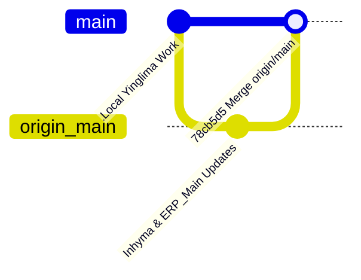

# Ecosystem Changelog & Git Merge Report

**Date:** September 23, 2026  
**Repository:** `https://github.com/rupeshinhyma-oss/ERP.git`  
**Merge Commit:** `78cb5d5 Merge remote-tracking branch 'origin/main'`  
**Branch Status:** Local `main` branch cleanly merged with `origin/main` (No git push performed; all changes remain safe locally).

---

## 1. Executive Summary

A full multi-repository synchronization was completed. Remote updates from `origin/main` for **ERP_Main** and **Inhyma_ERP** have been merged into the local ecosystem, while **100% of all local optimizations and enhancements for Yinglima_ERP have been safely preserved**.

---

## 2. Remote Changes Pulled & Merged (Inhyma_ERP & ERP_Main)

The following changes from remote `origin/main` were pulled and incorporated into the workspace:

### A. Inhyma_ERP (`Inhyma_ERP/`)
1. **Google Maps Platform & HRMS Location Hardening:**
   - Integrated Google Maps Places API (New) with support for autocomplete, direct map navigation, and geocoding.
   - Made latitude and longitude coordinates directly editable on the HRMS Location Master for enhanced precision.
   - Built interactive modals: `AddressMapConfirmModal.tsx` and `LocationMapPicker.tsx`.
   - Added Work-From-Home (WFH) requests management module (`HrmsWfhRequestsPage.tsx`, `WfhRequestModal.tsx`).
   - Added database migration: `d1a2b3c4d5e6_create_hrms_location_and_wfh_tables.py`.
2. **Sales Process & Procurement Restructure:**
   - Implemented complete Sales Process module (`SaleProcessList.tsx`, `SaleProcessForm.tsx`, `SaleProcessDetailModal.tsx`, `process_routes.py`, `sales/service.py`).
   - Added Local Purchase (`LocalPurchasePage.tsx`, `LocalPurchasePdfPage.tsx`, `localPurchasePdf.ts`) with custom PDF generation.
   - Added Import Purchase (`ImportPurchasePage.tsx`, `ImportPurchasePdfPage.tsx`, `importPurchasePdf.ts`) with custom PDF generation.
   - Added Proforma Invoice management (`ProformaInvoicesPage.tsx`, `ProformaInvoicePdfPage.tsx`) with PDF generation.
   - Added Discount & Payment processing screen (`DiscountPaymentsPage.tsx`).
   - Removed deprecated `Inquiries` quotation module and legacy `Buyers.tsx` page.
3. **UI Components & Utilities:**
   - Added reusable `Combobox.tsx` and `DatePicker.tsx` components.
   - Cleaned Suppliers page styling and filters.

### B. ERP_Main (`ERP_Main/`)
1. **Ecosystem & Organization Switcher:**
   - Added `EcosystemSwitcher.tsx` to the topbar header.
   - Displays the current organization/ERP name on the switcher button.
   - Aligned switcher layout, removed search projections, and configured default redirect to `/dashboard`.
2. **Global Users & Navigation Polish:**
   - Merged `Users` and `Memberships` into a unified `User & Access` navigation menu item.
   - Renamed "Global Users Directory" to "Global Users" with polished table layout and responsive styling.
   - Polished search bar, status filters, and table padding.
   - Cleaned up Super Admin dashboard and master types.

---

## 3. Local Changes Retained & Committed (Yinglima_ERP)

All local modifications for **Yinglima_ERP** were staged, committed as `6e6123a`, and merged without any file conflicts:

### A. Product Name Substring Autocomplete (Tally-Style ERP Matching)
- **High-Speed Backend Endpoint:** Created `GET /api/v1/masters/products/names-lookup` in `backend/app/masters/products/routes.py` and `service.py`.
  - Performs lightweight trigram `ILIKE '%keyword%'` matching on `product_name_tally` and `product_name`.
  - Executes in **<50ms** across the full product catalog.
- **Instant Hybrid Matching:** Updated `Products.tsx` to search in-memory items instantly with 0ms delay while querying the lookup endpoint for full catalog coverage.
- **Searchable Dropdown Fix:** Corrected `SearchableDropdown.tsx` focus, click, and arrow-key handlers that previously reset query text to empty, restoring instant substring suggestions.

### B. Elimination of Heavy Network Loads & `(pending)` Requests
- **Supplier Lookup Cache:** Added `GET /api/v1/suppliers/lookup` in `backend/app/suppliers/routes.py` and `service.py` with in-memory caching.
- **Removed 500-Item Prefetch:** Removed redundant full-catalog queries on Product Master load and live websocket events.
- **Product Gallery Optimization:** Replaced `page_size=1000` with `page_size=100` and added `has_images=true` filtering in `backend/app/masters/products/repository.py` to only fetch products with actual images.

### C. Database Connection Pool Expansion
- Updated `DATABASE_POOL_SIZE` from `5` to `15` and `DATABASE_POOL_TIMEOUT_SECONDS` to `15` in `backend/.env`.
- Allows 9–11 parallel API requests on initial page loads to execute concurrently without queuing delays.
- Backend restarted on port 8001 with active pool size `15`.

### D. Sales Process 3-Dots Fixed Action Dropdown
- Fixed `SaleProcessList.tsx` action dropdown visibility with fixed viewport coordinates and high z-index, ensuring Edit and Delete options are never clipped by table boundaries.

---

## 4. Verification & Health Summary

| Component | Status | Verification Detail |
| :--- | :--- | :--- |
| **Git Working Tree** | Clean | Working tree clean; ahead of `origin/main` by 9 commits (all local). |
| **Yinglima Backend** | Healthy | Running on port `8001` (PID 15732). Health check `HTTP 200 OK`. |
| **Yinglima Frontend** | Built | `npm run build` completed with exit code 0 (0 TypeScript errors). |
| **Code Push State** | Safeguarded | **No git push** executed. All changes remain local. |
